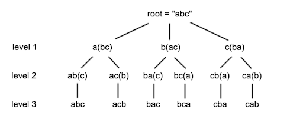

*Algorithm Approach* (the master theorem) :-

* Establish a base case — if our input’s size is less than a certain constant, solve it directly without recursion.

* If the input is bigger than said constant, break it down into smaller pieces.

* Call the function recursively on the pieces, until they are small enough to be solved directly.

* Combine the results from the pieces, and return the completed solution.

<pre>
            <h4> Example:- </h4>
            
 </pre>